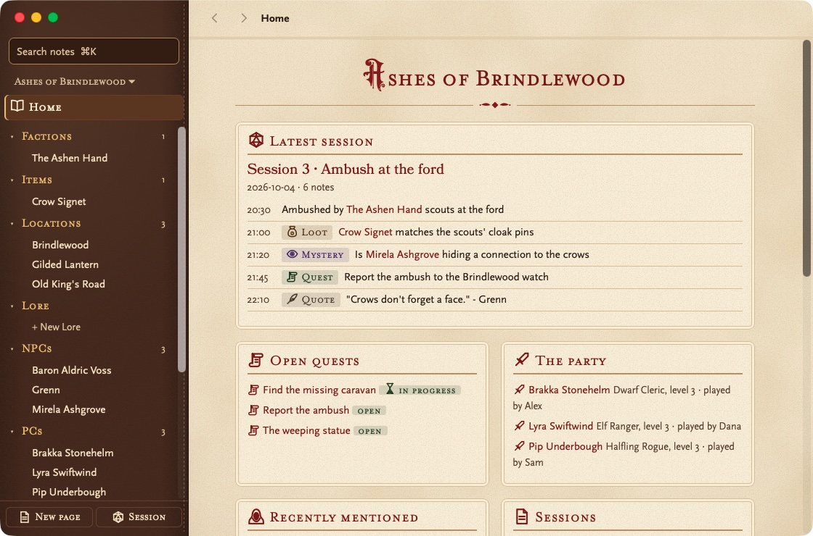
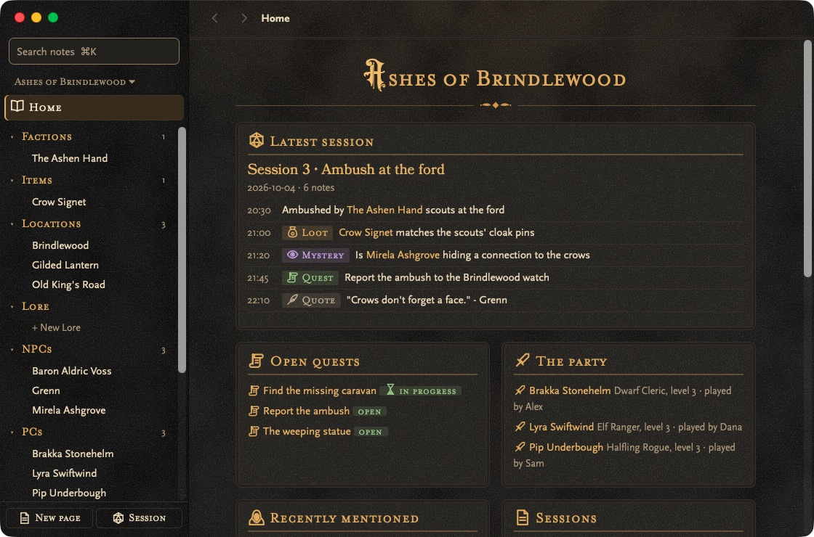

# Lorekeeper

Session notes for D&D players. Jot things down during the game without leaving Discord, keep them in a vault of NPCs, places and quests, and share the campaign with your party.

| Home, Light (Tome) | Session, Dark (Dungeon) |
|---|---|
|  |  |

## Features

- **Notes from anywhere:** `⌘⌥N` opens a one-line note box over any app; `⌘⇧S` saves the text you selected.
- **Notes sort themselves:** start with `@` NPC, `#` loot, `!` quest, `?` mystery or `"` quote.
- **Sessions as a timeline,** or as a journal grouped by kind.
- **Play with your party:** share a campaign with an invite link and every session shows everyone's notes together, each with who wrote it. It syncs end-to-end encrypted, so the sync server can't read them.
- **A campaign vault:** NPCs, PCs, places, items, factions, quests and lore with `[[links]]` and backlinks. Plain Markdown that Obsidian can open.
- **Characters from D&D Beyond:** import the party's PCs, portraits included.
- **Connections:** Home maps your NPCs, PCs, places and factions and who's linked to whom.
- **A cheat sheet** of every note symbol, link and shortcut: Help > Cheat Sheet (`⌘/` or `Ctrl+/`).
- **Backups** to a folder (a cloud drive or a USB drive), Dropbox, Google Drive or GitHub, and **automatic updates**.

## Download

Get the [latest release](https://github.com/yonatankarp/lorekeeper/releases/latest): `.dmg` for macOS, `-setup.exe` for Windows, `.AppImage` for Linux. Nothing else to install. The builds aren't code-signed yet, so the first launch shows a warning ([how to open it](docs/GUIDE.md#installing)).

## How to use it

1. During the game press `⌘⌥N` (Windows/Linux `Ctrl+Alt+N`), type `@Mirela, shifty innkeeper` and press Enter.
2. After the game open Lorekeeper and pick the session: every note with its time, or the Journal grouped by kind.

Everything else is in the [user guide](docs/GUIDE.md).

## Development

```bash
pnpm install
pnpm tauri dev   # run
pnpm test        # JS and Rust tests
```

Building, releasing and the update signing key: [docs/DEVELOPMENT.md](docs/DEVELOPMENT.md).

## Credits

Fonts: Solbera's D&D 5e fonts ([CC BY-SA 4.0](https://creativecommons.org/licenses/by-sa/4.0/), see [src/fonts](src/fonts/README.md)). Editor: [CodeMirror](https://codemirror.net). Markdown: [marked](https://marked.js.org).
